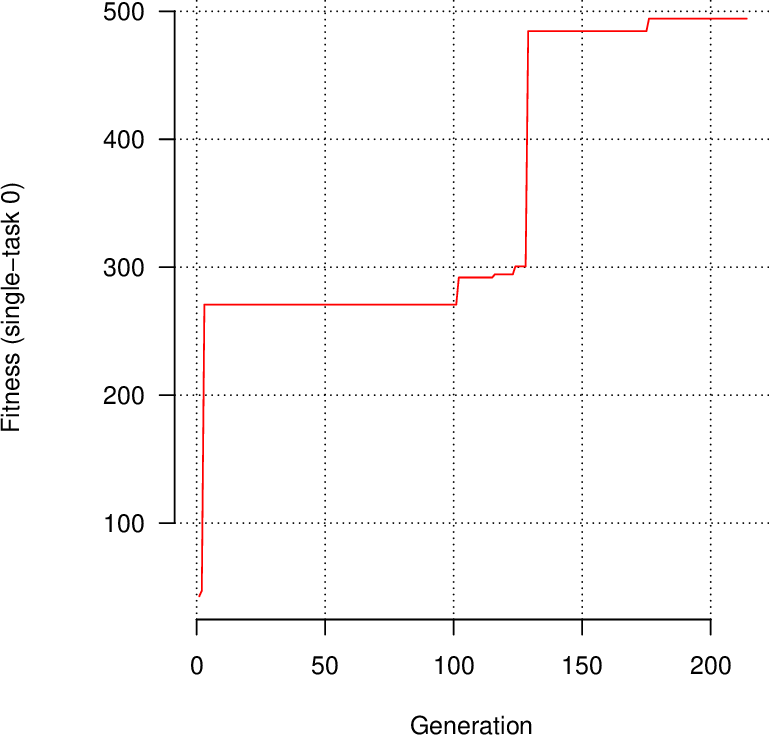

# Tangled Program Graphs (TPG)
This code reproduces results from the paper: 

Stephen Kelly, Tatiana Voegerl, Wolfgang Banzhaf, and Cedric Gondro. Evolving Hierarchical Memory-Prediction Machines in Multi-Task Reinforcement Learning. Genetic Programming and Evolvable Machines, 2021. [pdf](https://rdcu.be/czd3s)

## Quick Start
This code is designed to be used in Linux. If you use Windows, you can use Windows Subsystem for Linux (WSL). You can work with WSL in Visual Studio Code by following [this tutorial](https://code.visualstudio.com/docs/remote/wsl-tutorial).

### 1. Install required software
From the tpg directory run:
```
sudo xargs --arg-file requirements.txt apt install
```

### 2. Set environment variables
In order to easily access tpg scripts, we must add appropriate folders to the $PATH environment variable.
To do so, add the following to *~/.profile*
```
export TPG=<YOUR_PATH_HERE>/tpg
export PATH=$PATH:$TPG/scripts/plot
export PATH=$PATH:$TPG/scripts/run
```
Then run:
```
source ~/.profile
```

### 3. Compile
From the tpg directory run:
```
scons --opt
```

### 4. Run an experiment
The folder tpg/classic_control_example contains scripts to evolve policies for classic control tasks. Parameters are set in parameters.txt. The default settings will evolve a policy for the [CartPole](https://gymnasium.farama.org/environments/classic_control/cart_pole/) task.

To run an experiment using 4 parallel MPI processes, make tpg/classic_control_example your working directory and run:
```
tpg-run-mpi.sh -n 4
```

Note that as of right now, the number of assigned processes must be greater than the number of active tasks.

### 5. Plot results
Generate classic_control_example_p0.pdf with various statistics:
```
tpg-plot-stats.sh
```
The first page will be a training curve looking something like the plot below. A fitness of 500 indicates the agent balances the pole for 500 timesteps, thus solving the task.



### 6. Visualize the best policy's behaviour
Display an OpenGL animation of the single best policy interacting with the environment:
```
tpg-run-mpi.sh -m 1
```
 
### 7. Cleanup
Delete all checkpoints and output files:
```
tpg-cleanup.sh
```
